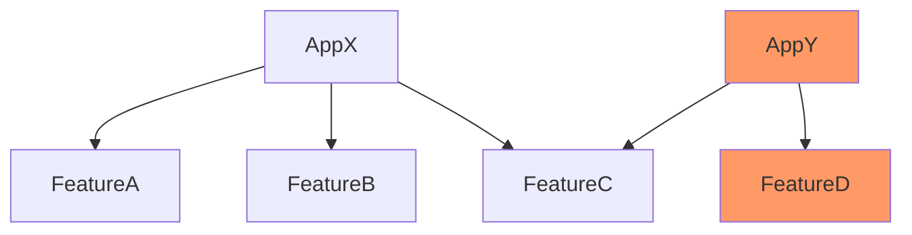

# Test impact analysis

Test impact analysis finds automatically a minimum set of tests that can verify changed code.

[The Rise of Test Impact Analysis](https://martinfowler.com/articles/rise-test-impact-analysis.html)

## On module level

Besides tests, we have different work to do in modules: Android Lint, unit-tests, assemble, ...\
If a module is not affected by changes, we don't want to run anything in it.

These optimizations are supported in [CI Steps Plugin](../projects/CiSteps.md).\
See implementation in `impact` module.
