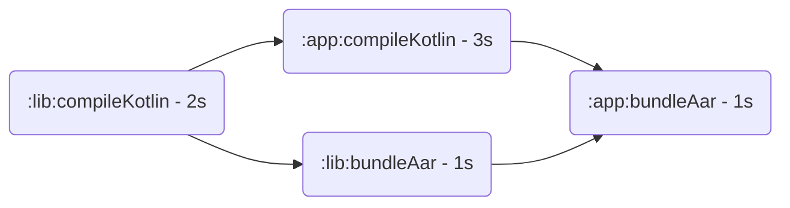

# Build metrics

???+ warning
    This plugin is internal and not recommended to use.  
    See alternatives: 
    [Gradle Enterprise](https://gradle.com/gradle-enterprise-solution-overview/), 
    [Talaiot](https://github.com/cdsap/Talaiot)

## Configuring

### Disabling plugin

Project property `avito.build.metrics.enabled=false`

## Metrics

All metrics can use common placeholders in prefix:

- Namespace: statsd prefix from `avito.stats.namespace` property
- Environment: `ci` | `local` | `_` (unknown)
- Node: git username for local builds, hostname for CI builds
- Build status: `success` | `failure`

They will be referred in docs as `<placeholder>`.

### Build cache metrics

[Http build cache](https://docs.gradle.org/current/userguide/build_cache.html#sec:build_cache_configure_remote) errors:

- `<namespace>.<environment>.<node>.build.cache.errors.[load|store].<http status code>`: errors counter
  
Remote cache statistics:

- `<namespace>.<environment>.<node>.build.cache.remote.[hit|miss]`: remote cache operations count by environments.  
Shows count of cacheable tasks that were requested from the remote cache.  
This is the same as **Performance** | **Build cache** | **Remote cache** | **Operations** | **Hit\Miss** in build scan.

### Common build metrics

- `<namespace>.<environment>.<node>.id.<build status>.init_configuration.total` (time in ms): initialization with configuration time
- `<namespace>.<environment>.<node>.id.<build status>.build-time.total` (time in ms): total build time

### Tasks metrics

- `<namespace>.<environment>.<node>.build.tasks.cumulative.any` (time in ms):  
  cumulative time of all tasks
  
#### Slowest tasks

These metrics give different aggregates for tasks to highlight the slowest ones.

- `<namespace>.<environment>.<node>.build.tasks.slow.task.<module>.<task type>` (time in ms):  
  top slowest tasks
- `<namespace>.<environment>.<node>.build.tasks.slow.type.<task type>` (time in ms):  
  cumulative time of top slowest task types
- `<namespace>.<environment>.<node>.build.tasks.slow.module.<module>` (time in ms):  
  cumulative time of tasks in top slowest modules

Example:

- `.tasks.cumulative.any`: 7s
- `.tasks.slow.task.app.KotlinCompile`: 3s
- `.tasks.slow.type.KotlinCompile`: 5s
- `.tasks.slow.module.app`: 4s

#### Critical path

These metrics describe a critical path.
To understand the critical path better see a visualization in a [build trace](../BuildTrace.md#critical-path).

- `<namespace>.<environment>.<node>.build.tasks.critical.task.<module>.<task type>` (time in ms):  
  tasks in the critical path

### Specific build events

- `<namespace>.<environment>.<node>.id.<build status>.app-build.<module path>.<task name>.finish` (time in ms): 
  elapsed time from build start till Android app build task finished
