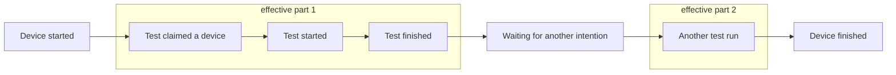

# Test runner metrics

Metrics available at:

`$namespace.testrunner.$buildId.$instrumentationConfigName.`

### `device-utilization.median`

Median of all effective device time relative to total device claimed time (in percent `0-100`)

### `initial-delay`

Single stat per test suite (instrumentation configuration)

### `end-delay`

Single stat per test suite

### `queue-median`

Median of tests queue time

### `install-median`

Median of installation times

### `suite`

Single stat per test suite

### `total`

Single stat per test suite

## `tests.status.lost.`

Tests count with lost status with categorized reasons:

### `not-reported`

Don't know exact reason, delta between initial test suite and reported tests

### `no-file`

Test report data pulled from device and then pushed to report service. \
These are cases when file was not found on device for some reason

### `parse-errors`

If test file was pulled, but there was a parsing error

## `adb`

Lower level metrics from AdbDevice, to observe device connection issues. \
It is count metrics, aggregated by time windows

### `get-sdk-property`.[ `success` / `attempt-fail` / `failure` ]

### `install-application`.[ `success` / `attempt-fail` / `failure` ]

### `get-alive-device`.[ `success` / `attempt-fail` / `failure` ]

### `clear-package`.[ `success` / `attempt-fail` / `failure` ]

### `pull`.[ `success` / `attempt-fail` / `failure` ]

### `clear-directory`.[ `success` / `nothing` / `attempt-fail` / `failure` ]

### `list`.[ `success` / `nothing` / `attempt-fail` / `failure` ]

### `run-test`.[ `passed` / `ignored` / `error` / `infrastructure-err` / `failed-on-start` / `failed-instrum-parse` ]
